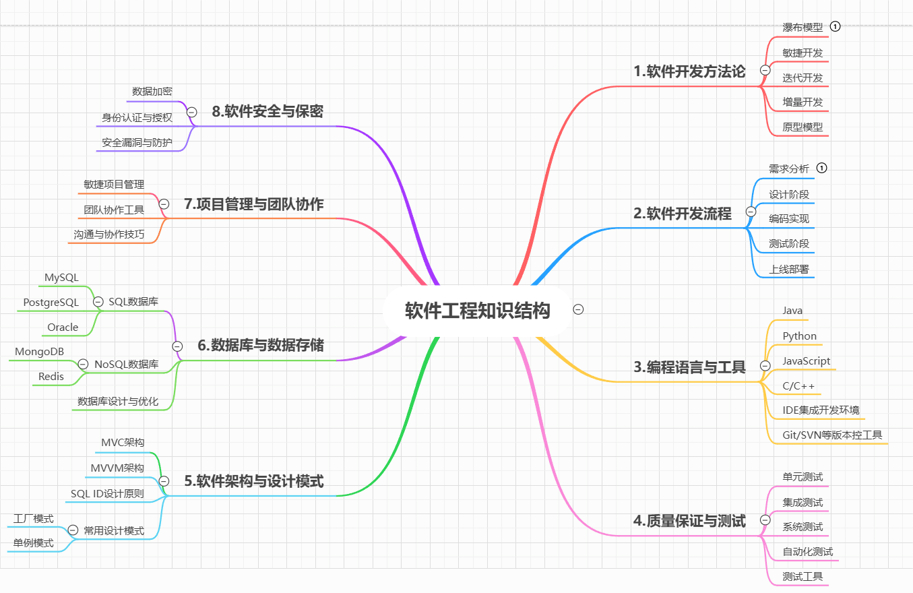

# 软件工程思维导图&学习总结

## 一、思维导图

## 二、学习总结

现代软件工程涵盖了广泛而深刻的知识领域，包括软件开发方法论、软件开发流程、编程语言与工具、质量保证与测试、软件架构与设计模式、数据库与数据存储、软件架构与设计模式、项目管理与团队协作以及软件安全与保密等方面。以下是对这些主要内容的概述和学习要点。

#### 1. 软件开发方法论

​     选择正确的软件开发方法论对于项目的成功至关重要。每种方法都有其优势和最佳适用场景，理解这些差异可以帮助团队制定更有效的开发策略。无论是选择传统的瀑布模型，还是采用敏捷、DevOps或精益开发，关键在于根据项目特性和团队能力来定制最适合的方法论。   

​    现代软件开发有多种方法论，包括瀑布模型、敏捷开发、迭代开发、增量开发和原型模型等。了解各种方法论的特点和适用场景，能够帮助团队选择合适的开发方法，提高开发效率和产品质量。

#### 2. 软件开发流程

​     软件开发流程通常包括需求启动、规划、需求和上线部署等环节。每个环节都有其特定的任务和技术要点，掌握这些流程能够帮助开发者更好地组织和管理项目。

（1）、启动

在项目启动阶段，主要确定项目的目标及其可行性。我们需要对项目的背景、干系人、解决的问题等等进行了解。并编制项目章程和组建项目团队，包括：产品经理、架构工程师、UI工程师、开发工程师、测试工程师等。

完成以上准备工作之后，召开项目启动会，启动会结束则进入下一步的工作。

（2）、规划

在项目的规划阶段，项目经理需要和项目需求方，以及项目的相关干系人确定项目的范围，创建WBS，确定项目的里程碑和项目计划。同时制定项目的管理计划，包括成本、质量、风险等方面的预测和控制方案。

（3）、需求

在需求阶段，需要对采集的需求进行需求分析，编写PRD文档、UI设计、高保真设计。

最后进入需求评审，评审通过则进入下一步的工作

（4）、设计

在设计阶段，设计人员根据需求文档，对软件系统进行设计，包括数据结构、系统架构、业务模型及规则、流程控制、模块接口等。 输出概要设计，详细设计文档，以及数据库设计说明书等。

（5）、开发

在明确需求后，开发工程师正式进入编码阶段，根据产品原型图、UI效果图、设计文档，选择合适的开发环境、开发工具、开发语言等等进行实现，这个阶段也是个很长很难的阶段，也是软件实现的核心。

（6）、功能测试

对软件进行测试是保证软件质量的重要手段。开发工程师开发完成后，可以交由测试工程师测试。测试工程师测试到BUG要反馈给开发，开发进行修改。功能测试通常需要进行很多次，直到测试通过，达到质量要求。

（7）、端到端测试

在端到端测试阶段，测试人员根据完整的业务流程设计可以覆盖全流程的端到端测试案例，然后基于端到端案例对系统的各个模块进行全面测试，确保系统能够符合需求和验收质量标准。

（8）、用户验收测试

用户验收测试阶段，也是通常的UAT(User Acceptance Test)阶段，用户验收测试是最终用户可以检查软件是否符合业务要求的最后阶段。UAT由了解要求并了解构建软件目的的最终用户执行。此测试是在软件运行之前执行的最后一次测试。最终用户使用现实生活场景并为真实数据构建UAT测试用例，用户验收测试在最终用户在上线之前验证软件是否满足这些业务需求方面具有重要作用。

（9）、上线

所有测试通过，并与客户或者上级达成一致后，系统进行试运行，稳定后上线。

上线包括：上线部署、部署后验证、整理交付物（需求文档、设计文档、安装部署手册、产品帮助等等）和[运维](https://cloud.tencent.com/solution/operation?from_column=20065&from=20065)移交。

（10）、收尾

项目的收尾阶段，移交项目成果，释放项目团队，进行项目回顾总结，项目汇报，完成项目结项。

#### 3. 编程语言与工具

​     掌握一门或多门编程语言，以及常用的开发工具和集成开发环境（IDE），是软件工程师的基本素养。常见的编程语言包括Java、Python、JavaScript和C/C++等。

#### 4. 质量保证与测试

​     在实际应用过程中，软件质量保证与测试可以从以下几个方面进行：

​        （1）、针对软件中可能存在的问题进行深入的分析，并将其转化为测试条件；

​        （2）、编写测试过程、测试样例和测试脚本，并进行不断的反复测试；

​        （3）、有效收集用户反馈，及时发现问题并跟踪解决；

​        （4）、开发自动化测试脚本，大大提高测试的效率。      

​     通过这门课程，我对软件质量保证与测试有了更加深入的认识，实践能力也有了一定的提升，它让我更加清楚软件质量保证与测试的重要性，以及如何正确开展这一项重要工作，从而使软件产品兼具安全、稳定性和可靠性。 

​      总的来说，软件测试是确保软件质量的重要手段，包括单元测试、集成测试、系统测试和自动化测试等。掌握各种测试方法和工具，能够有效地发现和修复软件缺陷，提高软件的稳定性和可靠性。对其有了更深的理解和实践能力，能够更加熟练地运用软件质量保证与测试的技术来提高软件产品的质量，节省客户的维护成本，满足用户的要求，提升软件的效益。

#### 5. 软件架构与设计模式

​      良好的软件架构和设计模式能够提高软件的可维护性和扩展性，减少代码的复杂度和耦合度。常见的软件架构包括MVC架构和MVVM架构，常用的设计模式包括工厂模式和单例模式等。

#### 6. 数据库与数据存储

​      数据是软件的重要组成部分，数据库是数据存储和管理的关键技术。掌握SQL数据库和NoSQL数据库的设计和优化技巧，能够提高数据处理的效率和安全性。

#### 7. 项目管理与团队协作

​      良好的项目管理和团队协作是保障项目成功的关键因素，包括敏捷项目管理、团队协作工具和沟通与协作技巧等。团队成员之间的有效沟通和合作，能够提高项目的执行效率和团队的凝聚力。

​      团队协作的关键要素：

​                **共享愿景和目标**
​          团队协作的第一个关键要素是确立共享的愿景和目标。共同的愿景和目标能够凝聚团队成员的力量，让每个人都明确自己的工作与项目整体的关联。项目管理者应该与团队成员共同制定明确的目标，并明确表达项目的愿景，激发团队成员的热情和动力。

​               **有效的沟通与协调****
​          在团队协作中，沟通起着至关重要的作用。项目管理者应该鼓励积极主动的沟通，并建立良好的沟通渠道，确保信息的流动和理解。同时，协调团队成员之间的工作也是必不可少的。项目管理者应该具备良好的协调能力，能够合理分配任务，协调不同成员之间的工作进度，以实现整体的协同效应。

​                **互相信任和尊重**
​          团队协作的基石之一是互相信任和尊重。团队成员之间建立起坚实的信任关系，能够有效地推动合作，减少摩擦和冲突。项目管理者应该鼓励团队成员相互支持，培养团队文化，倡导开放的沟通和尊重每个人的意见和贡献。只有在信

#### 8. 软件安全与保密

​      软件安全是保障用户数据和系统安全的重要保障，包括数据加密、身份认证与授权和安全漏洞与防护等方面。了解常见的安全攻防技术和防护措施，能够有效地保护软件系统免受攻击和损害。

​       通过学习现代软件工程知识，我们能够更好地理解和应用软件开发的方法和技术，提高软件开发的效率和质量，为用户提供更好的软件产品和服务。